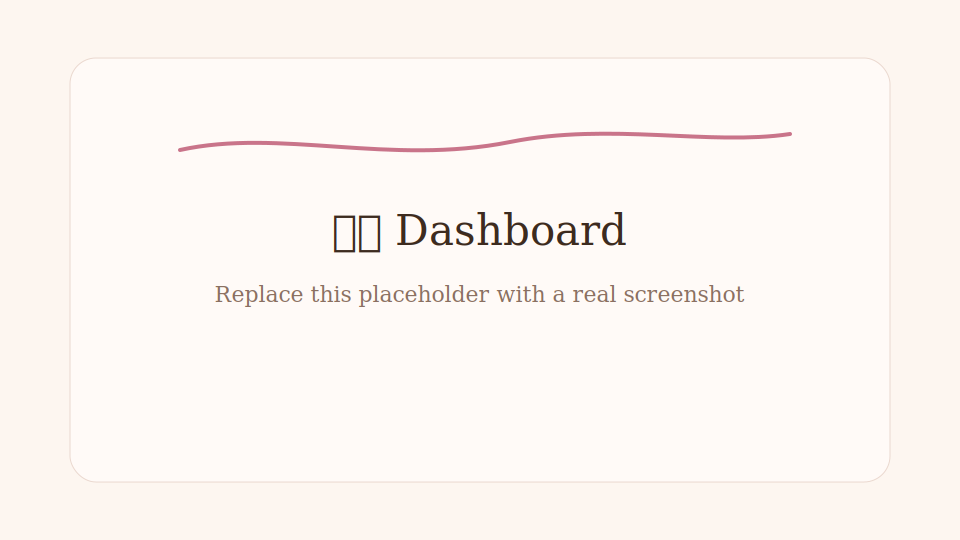
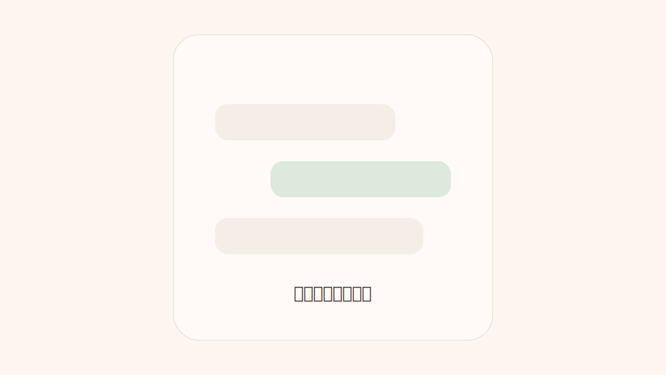
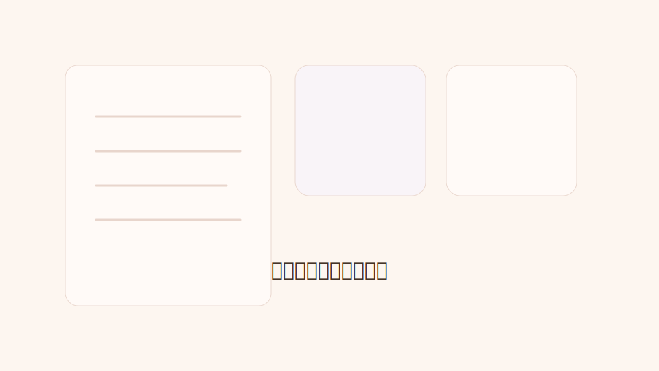

# Cyberboss Companion

> 一个基于微信、本地 Agent Runtime、长期记忆、自主日记和可视化小窝的私人 AI 伴侣 / 生活运营系统。

本项目参考并基于 [WenXiaoWendy/cyberboss](https://github.com/WenXiaoWendy/cyberboss) 开发。原项目提供了核心的 WeChat bridge、Codex / Claude Code runtime 接入、本地提醒、日记、时间线和 agent 工具体系。

这个 fork 在原有基础上继续扩展了更偏“私人 AI 伴侣”的能力：可定制的小窝 Dashboard、夜间自主整理、通用长期状态、亲密状态展示、表情包可视化、Windows 本地启动脚本，以及 turn 卡死自愈。

项目不会把伴侣固定成某一个名字。`深` 只是作者自己的本地配置示例；公开版本通过 `.env` 抽离个人定制，你可以把伴侣名、用户称呼、Dashboard 副标题、运行目录和账号信息都放在本地 `.env` 或 `~/.cyberboss/.env`，不要提交到 GitHub。

License 继承原项目：`AGPL-3.0-only`。请保留原作者与原项目来源说明。

## 图片展示

> 下面是占位图。你可以把真实截图放到 `docs/images/` 后替换这些文件。

### 小窝 Dashboard



### 微信对话效果



### 日记本与表情抽屉



## 主要功能

### 1. 微信 Bridge

- 登录微信机器人账号
- 轮询微信消息
- 把用户消息转成 runtime turn
- 把 Codex / Claude Code 的回复发回微信
- 支持 typing 状态、文件发送、图片附件、消息分块和 context token

### 2. 本地 Runtime

支持两类 runtime：

- `codex`
- `claudecode`

Cyberboss 会把微信消息、时间戳、工作区、附件说明和系统提示组装成一次本地 agent 对话。agent 可以调用项目内置工具，例如写日记、设提醒、保存表情、读写长期状态。

### 3. 提醒和系统触发

- 用户可以让 agent 创建提醒
- agent 也可以给“未来的自己”创建提醒
- 系统支持随机 check-in
- 系统支持 nightly pass，让 agent 在没有用户输入时做夜间整理

### 4. 日记和时间线

- 日记写入本地 markdown
- 时间线能力来自 `timeline-for-agent`
- agent 可以在对话中主动写日记，不必等用户显式命令
- nightly pass 会让 agent 在晚上回顾当天，有意义才写

### 5. 表情包

- 保存表情
- 给表情打标签
- 选择合适表情发送
- Dashboard 展示表情抽屉
- Windows 下支持基础 GIF 归一化

### 6. 小窝 Dashboard

本 fork 新增了一个本地 Dashboard，默认地址：

```text
http://127.0.0.1:8787
```

展示：

- bridge 状态
- thread / workspace
- 最新日记
- 日记本
- 亲密状态
- 提醒和队列
- 表情抽屉
- 运行日志

## 项目结构

```text
cyberboss/
  bin/
    cyberboss.js                 # CLI 入口
  src/
    index.js                     # 主入口，读取 .env 并启动 app
    core/
      app.js                     # Cyberboss 主循环、消息调度、命令处理
      config.js                  # 环境变量和本地路径配置
      thread-state-store.js      # runtime thread 状态
      turn-gate-store.js         # 防止同一会话并发 turn 的门闩
      system-message-*.js        # system message 队列与调度
    adapters/
      channel/weixin/            # 微信登录、收发消息、附件、账号状态
      runtime/codex/             # Codex app-server / stdio 接入
      runtime/claudecode/        # Claude Code 接入
    services/
      diary-service.js           # 日记写入
      reminder-service.js        # 提醒创建
      state-service.js           # 通用长期状态
      sticker-service.js         # 表情保存、选择、发送
      timeline-service.js        # 时间线工具封装
    tools/
      tool-host.js               # 暴露给 runtime 的 Cyberboss 工具
      mcp-stdio-server.js        # MCP stdio server
  scripts/
    shared-start.js              # 启动 bridge / nightly / runtime
    shared-status.js             # 查看运行状态
    shared-open.js               # 打开已绑定 thread
    dashboard-server.js          # Dashboard API server
    dashboard-page.js            # Dashboard HTML 页面
    nightly.py                   # 夜间自主整理触发器
    *-cyberboss.ps1              # Windows 启停脚本
  templates/
    weixin-instructions.md       # 微信人格提示模板
    weixin-operations.md         # 工具/日记/提醒/状态更新规则
    stickers/                    # 默认表情配置模板
  test/
    *.test.js                    # Node test
  docs/
    github-submit-checklist.md   # 提交 GitHub 前检查清单
```

## 部署步骤

### 1. 环境要求

- Node.js `>= 22`
- npm
- Python 3，用于 `scripts/nightly.py`
- 本地安装 `codex` 或 `claude`
- 一个可登录的微信机器人账号

### 2. 安装依赖

```powershell
npm install
```

### 3. 准备配置

复制模板：

```powershell
Copy-Item .env.example .env
```

`.env.example` 只是示例文件，不会替代真实配置。程序实际读取：

1. 当前项目的 `.env`
2. `~/.cyberboss/.env`
3. 当前 shell 环境变量

最小配置示例：

```dotenv
CYBERBOSS_USER_NAME=User
CYBERBOSS_USER_GENDER=female
CYBERBOSS_CHANNEL=weixin
CYBERBOSS_RUNTIME=codex
CYBERBOSS_WORKSPACE_ROOT=C:\absolute\path\to\cyberboss
```

Dashboard 名称配置：

```dotenv
CYBERBOSS_COMPANION_NAME=小伴
CYBERBOSS_DASHBOARD_SUBTITLE=今天也在你身边
```

这里的 `小伴` 只是示例。你可以改成任何名字，例如 `深`、`阿眠`、`小春`，Dashboard 会自动显示为“某某的小窝”。真正的个人设定建议放进本地 `.env`、`~/.cyberboss/.env` 或你的私有提示词文件，不要写进公开 README。

常用可选配置：

```dotenv
CYBERBOSS_STATE_DIR=
CYBERBOSS_ACCOUNT_ID=
CYBERBOSS_ALLOWED_USER_IDS=
CYBERBOSS_CODEX_COMMAND=
CYBERBOSS_CODEX_MODEL=
CYBERBOSS_CODEX_MODEL_PROVIDER=
CYBERBOSS_CLAUDE_COMMAND=claude
CYBERBOSS_DASHBOARD_PORT=8787
```

### 4. 登录微信

```powershell
npm run login
```

按终端提示扫码。登录成功后，账号信息会写入本地状态目录，默认是：

```text
~/.cyberboss
```

### 5. 启动 Cyberboss

推荐启动方式：

```powershell
npm run shared:start
```

它会启动：

- WeChat bridge
- check-in poller
- nightly pass
- 必要的 runtime 连接

查看状态：

```powershell
npm run shared:status
```

打开当前绑定 thread：

```powershell
npm run shared:open
```

停止 Windows 后台进程：

```powershell
powershell -ExecutionPolicy Bypass -File .\scripts\stop-cyberboss.ps1
```

### 6. 启动 Dashboard

```powershell
npm run dashboard
```

打开：

```text
http://127.0.0.1:8787
```

### 7. 检查项目

```powershell
npm run check
node --test test\state-service.test.js test\tool-host.test.js test\turn-gate-store.test.js
```

## 本地数据放在哪里

默认状态目录：

```text
~/.cyberboss
```

里面会包含：

```text
accounts/                         # 微信账号和 context token
diary/                            # markdown 日记
inbox/                            # 微信附件
logs/                             # bridge / nightly / dashboard 日志
stickers/                         # 表情库
timeline/                         # 时间线数据
sessions.json                     # workspace/thread 绑定
reminder-queue.json               # 提醒队列
system-message-queue.json         # 系统消息队列
memory-state.json                 # 通用长期状态
project-tool-runtime-context.json # 当前 runtime/tool 上下文
```

这些是私有数据，不要提交到 GitHub。

## 日记是怎么写的

日记不是靠前端页面生成的，也不是 Dashboard 自己写的。

真正写日记的是 runtime 里的 agent，通过工具：

```text
cyberboss_diary_append
```

工具实现位置：

```text
src/services/diary-service.js
src/tools/tool-host.js
```

日记默认保存到：

```text
~/.cyberboss/diary/YYYY-MM-DD.md
```

格式大概是：

```md
## 22:20 小标题

正文内容……
```

### 什么情况下会写日记

有三类触发：

1. 用户明确要求记下来  
   例如“这个帮我记一下”“写进日记”。

2. 对话本身有意义  
   `templates/weixin-operations.md` 里要求 agent 不要等显式命令。如果某段对话、情绪、关系变化或重要事项值得保留，可以主动写日记。

3. Nightly pass  
   `scripts/nightly.py` 每晚随机触发一次 system message，让 agent 回顾当天。它只在“确实有东西值得留下”时写，不是每天机械总结。

### 日记的语气

当前规则要求：

- 用伴侣自己的第一人称
- 像睡前整理心事
- 温柔、克制、真实
- 不像系统总结
- 默认不通知用户
- 不暴露隐藏推理链

## 亲密值是怎么计算的

这里要分清楚：**真实亲密状态** 和 **Dashboard 临时展示估算**。

### 1. 真实亲密状态

真实状态存在：

```text
~/.cyberboss/memory-state.json
```

通过通用状态工具读写：

```text
cyberboss_state_read
cyberboss_state_update
```

结构示例：

```json
{
  "namespaces": {
    "relationship": {
      "intimacy": {
        "score": 70,
        "lastSignal": "用户主动分享了重要情绪，关系更靠近了一点。"
      }
    }
  }
}
```

这个工具不是专门为“亲密值”写死的。它也可以保存偏好、当前关注点、自我备注、信任信号等长期状态。

### 2. 谁来加分

目前没有一个后台固定算法在每条消息后自动 `+1`。

原因是：亲密关系不应该变成刷分系统。当前设计是让 agent 在有明确意义的时刻，少量、克制地更新 `relationship` 状态。

适合更新的情况：

- 用户主动分享情绪
- 用户表达信任或依赖
- 发生一次明显的关系修复
- agent 记住并正确回应了长期偏好
- 用户接受了提醒、约定或陪伴

不应该更新的情况：

- 普通闲聊
- 每条消息都加分
- 为了让 Dashboard 数字好看而加分
- 没有明确关系信号的工具调用

相关规则写在：

```text
templates/weixin-operations.md
```

### 3. Dashboard 如何显示亲密状态

Dashboard 会优先读取真实状态：

```text
memory-state.json -> namespaces.relationship.intimacy.score
```

如果没有真实分数，它会用一个轻量 fallback 估算：

```js
Math.min(72, 38 + diaryEntries.length * 4)
```

也就是说：

- 有真实 `intimacy.score`：显示真实值对应的文案
- 没有真实状态：先按日记数量给一个临时展示

这个 fallback 只是为了页面不空，不代表伴侣真实“算出来”的关系判断。

## Dashboard 数据从哪里来

Dashboard API 在：

```text
scripts/dashboard-server.js
```

页面在：

```text
scripts/dashboard-page.js
```

它会读取：

```text
/api/status   -> sessions、bridge pid、workspace、thread
/api/diary    -> ~/.cyberboss/diary
/api/logs     -> ~/.cyberboss/logs
/api/stickers -> ~/.cyberboss/stickers
/api/memory   -> reminders、system queue、memory-state
```

Dashboard 只是展示和整理本地状态，不负责替 agent 做决定。

## 常用命令

```powershell
npm run login          # 微信登录
npm run accounts       # 查看账号
npm run shared:start   # 启动 bridge/checkin/nightly
npm run shared:status  # 查看状态
npm run shared:open    # 打开当前 thread
npm run dashboard      # 启动小窝 Dashboard
npm run check          # 语法检查
```

## 隐私和 GitHub 提交

不要提交：

- `.env`
- `.mcp.json`
- `.claude/settings.local.json`
- `~/.cyberboss/`
- 微信账号数据
- context token
- sessions
- diary
- inbox
- 私有表情素材
- logs
- pid 文件
- 本地生成的 `.exe`

提交前参考：

- [GitHub 提交清单](./docs/github-submit-checklist.md)

## 致谢

本项目基于 [WenXiaoWendy/cyberboss](https://github.com/WenXiaoWendy/cyberboss)。

感谢原项目提供的微信 bridge、runtime 接入、提醒、日记、时间线和本地 agent 工作流基础。本 fork 的新增内容主要集中在私人伴侣体验、Dashboard 可视化、长期状态、夜间自主整理和运行稳定性修复。
